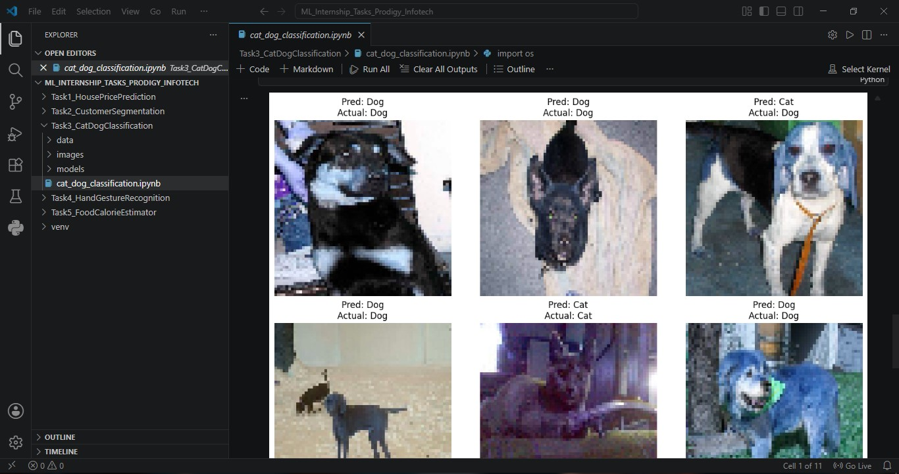

# 🐱🐶 Cat Dog Image Classifier

A Machine Learning-based image classification system that identifies whether an image contains a cat or a dog using Computer Vision techniques.

The project demonstrates image preprocessing, feature extraction, model training, and classification using Python and Scikit-Learn.

---

## 🚀 Features

- Cat and dog image classification
- Image preprocessing
- Feature extraction
- Machine Learning-based prediction
- Dataset visualization
- Model evaluation

---

## 🛠️ Tech Stack

- Python
- OpenCV
- NumPy
- Matplotlib
- Scikit-Learn
- Jupyter Notebook

---

## 📂 Project Structure

```text
Cat-Dog-Image-Classifier
│
├── data/
├── images/
├── models/
├── cat_dog_classification.ipynb
└── README.md
```

---

## 🐾 Classes

The model is trained to classify:

- Cat
- Dog

---

## ⚙️ How It Works

1. Load image dataset.
2. Preprocess and resize images.
3. Extract image features.
4. Train a Machine Learning classification model.
5. Predict image categories.
6. Evaluate model performance.

---

## 📊 Sample Output

Example Prediction:

```text
Predicted: Dog
Actual: Dog
```

The system displays:

- Predicted Class
- Actual Class
- Visual Prediction Results

---

## 📸 Project Preview

Add screenshots after uploading them to the repository.

```md


```

---

## 🎯 Learning Outcomes

Through this project, I gained practical experience in:

- Computer Vision
- Image Processing
- Feature Extraction
- Classification Models
- Dataset Handling
- Model Evaluation

---

## 🔮 Future Improvements

- Improve classification accuracy
- Implement Deep Learning (CNNs)
- Support multiple animal classes
- Real-time image classification
- Web application deployment

---

## 👩‍💻 Author

**Madhura Malap**

GitHub: https://github.com/Madhura-Malap
